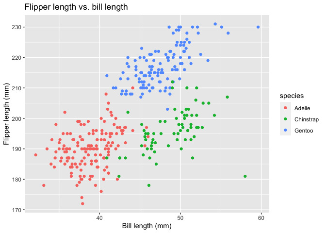

P8105 Homework \#1
================
Zachary Katz (UNI: zak2132)
September 2021

## Problem 1

Problem 1 asks us to create a data frame comprised of:

-   A random sample of size 10 from a standard normal distribution
-   A logical vector indicating whether elements of the sample are
    greater than 0
-   A character vector of length 10
-   A factor vector of length 10, with 3 different factor “levels”

### Create the data frame

First, we create the data frame by constructing four different variables
(vectors), and then binding them together using the `data.frame`
command.

``` r
# Create the variables/vectors separately
rand_sample <- rnorm(10)
logical_vector <- rand_sample > 0
character_vector <- c("s", "t", "r", "a", "w", "b", "e", "r", "r", "y")
factor_vector <- factor(c("first", "second", "third", "first", "second", "third", "first", "second", "third", "first"))

# Construct a data frame from the vectors
test_data_frame <- data.frame(rand_sample, logical_vector, character_vector, factor_vector)

# Examine the data frame
test_data_frame
```

    ##    rand_sample logical_vector character_vector factor_vector
    ## 1  -0.68279626          FALSE                s         first
    ## 2  -0.20110857          FALSE                t        second
    ## 3   0.52933748           TRUE                r         third
    ## 4  -0.55165074          FALSE                a         first
    ## 5  -1.04945826          FALSE                w        second
    ## 6  -0.02028034          FALSE                b         third
    ## 7  -0.09425155          FALSE                e         first
    ## 8   0.89836082           TRUE                r        second
    ## 9  -1.44235264          FALSE                r         third
    ## 10  0.08610837           TRUE                y         first

``` r
# Show the data frame's structure
str(test_data_frame)
```

    ## 'data.frame':    10 obs. of  4 variables:
    ##  $ rand_sample     : num  -0.683 -0.201 0.529 -0.552 -1.049 ...
    ##  $ logical_vector  : logi  FALSE FALSE TRUE FALSE FALSE FALSE ...
    ##  $ character_vector: chr  "s" "t" "r" "a" ...
    ##  $ factor_vector   : Factor w/ 3 levels "first","second",..: 1 2 3 1 2 3 1 2 3 1

By examining the structure of the data frame, we confirmed that the
first column is a numeric variable, the second is a logical vector, the
third is a character vector, and the fourth is a factor vector. Each
vector has 10 observations.

#### Find the means

Now that we’ve created the data frame, we try to take the mean of each
variable.

``` r
# Extract the columns one at a time and take a mean of each vector
sample_mean <- mean(pull(test_data_frame, rand_sample))
mean_positive <- mean(pull(test_data_frame, logical_vector))
mean_character_vector <- mean(pull(test_data_frame, character_vector))
```

    ## Warning in mean.default(pull(test_data_frame, character_vector)): argument is
    ## not numeric or logical: returning NA

``` r
mean_factor_vector <- mean(pull(test_data_frame, factor_vector))
```

    ## Warning in mean.default(pull(test_data_frame, factor_vector)): argument is not
    ## numeric or logical: returning NA

-   The mean of the random sample is -0.2528092 and the mean of the
    logical vector is 0.3, which is the proportion of the random sample
    (of 10 observations) greater than 0.

-   When we try to find the mean of the character and factor vectors, we
    learn that the mean function does not accept arguments that are not
    numeric or logical, and therefore returns NA.

#### Convert vectors

Finally, we want to convert the logical, character, and factor variables
to numeric variables if possible.

``` r
# Convert logical vector to numeric vector
convert_logical_to_numeric <- as.numeric(logical_vector)
convert_logical_to_numeric

# Convert character vector to numeric vector
convert_character_to_numeric <- as.numeric(character_vector)
```

    ## Warning: NAs introduced by coercion

``` r
convert_character_to_numeric

# Convert factor vector to numeric vector
convert_factor_to_numeric <- as.numeric(factor_vector)
convert_factor_to_numeric
```

-   Converting the logical vector to a numeric vector changed **true to
    1** and **false to 0**.

-   Converting the factor vector to a numeric vector changed **first
    level to 1, second level to 2, and third level to 3**.

-   Converting the character vector to a numeric vector resulted in
    **“NAs introduced by coercion”**, leading to a vector composed only
    of 10 NAs.

## Problem 2

#### Load the penguins dataset

``` r
# Load penguins dataset
data("penguins", package = "palmerpenguins")
```

#### Describe the penguins dataset

First, we want to take a quick look at the `penguins` data and its
structure.

``` r
# Examine penguins data set
penguins
```

    ## # A tibble: 344 × 8
    ##    species island    bill_length_mm bill_depth_mm flipper_length_mm body_mass_g
    ##    <fct>   <fct>              <dbl>         <dbl>             <int>       <int>
    ##  1 Adelie  Torgersen           39.1          18.7               181        3750
    ##  2 Adelie  Torgersen           39.5          17.4               186        3800
    ##  3 Adelie  Torgersen           40.3          18                 195        3250
    ##  4 Adelie  Torgersen           NA            NA                  NA          NA
    ##  5 Adelie  Torgersen           36.7          19.3               193        3450
    ##  6 Adelie  Torgersen           39.3          20.6               190        3650
    ##  7 Adelie  Torgersen           38.9          17.8               181        3625
    ##  8 Adelie  Torgersen           39.2          19.6               195        4675
    ##  9 Adelie  Torgersen           34.1          18.1               193        3475
    ## 10 Adelie  Torgersen           42            20.2               190        4250
    ## # … with 334 more rows, and 2 more variables: sex <fct>, year <int>

``` r
# Review head and tail of the data (first and last 10 rows, respectively)
head(penguins)
```

    ## # A tibble: 6 × 8
    ##   species island bill_length_mm bill_depth_mm flipper_length_… body_mass_g sex  
    ##   <fct>   <fct>           <dbl>         <dbl>            <int>       <int> <fct>
    ## 1 Adelie  Torge…           39.1          18.7              181        3750 male 
    ## 2 Adelie  Torge…           39.5          17.4              186        3800 fema…
    ## 3 Adelie  Torge…           40.3          18                195        3250 fema…
    ## 4 Adelie  Torge…           NA            NA                 NA          NA <NA> 
    ## 5 Adelie  Torge…           36.7          19.3              193        3450 fema…
    ## 6 Adelie  Torge…           39.3          20.6              190        3650 male 
    ## # … with 1 more variable: year <int>

``` r
tail(penguins)
```

    ## # A tibble: 6 × 8
    ##   species island bill_length_mm bill_depth_mm flipper_length_… body_mass_g sex  
    ##   <fct>   <fct>           <dbl>         <dbl>            <int>       <int> <fct>
    ## 1 Chinst… Dream            45.7          17                195        3650 fema…
    ## 2 Chinst… Dream            55.8          19.8              207        4000 male 
    ## 3 Chinst… Dream            43.5          18.1              202        3400 fema…
    ## 4 Chinst… Dream            49.6          18.2              193        3775 male 
    ## 5 Chinst… Dream            50.8          19                210        4100 male 
    ## 6 Chinst… Dream            50.2          18.7              198        3775 fema…
    ## # … with 1 more variable: year <int>

``` r
# Review structure of the data
str(penguins)
```

    ## tibble [344 × 8] (S3: tbl_df/tbl/data.frame)
    ##  $ species          : Factor w/ 3 levels "Adelie","Chinstrap",..: 1 1 1 1 1 1 1 1 1 1 ...
    ##  $ island           : Factor w/ 3 levels "Biscoe","Dream",..: 3 3 3 3 3 3 3 3 3 3 ...
    ##  $ bill_length_mm   : num [1:344] 39.1 39.5 40.3 NA 36.7 39.3 38.9 39.2 34.1 42 ...
    ##  $ bill_depth_mm    : num [1:344] 18.7 17.4 18 NA 19.3 20.6 17.8 19.6 18.1 20.2 ...
    ##  $ flipper_length_mm: int [1:344] 181 186 195 NA 193 190 181 195 193 190 ...
    ##  $ body_mass_g      : int [1:344] 3750 3800 3250 NA 3450 3650 3625 4675 3475 4250 ...
    ##  $ sex              : Factor w/ 2 levels "female","male": 2 1 1 NA 1 2 1 2 NA NA ...
    ##  $ year             : int [1:344] 2007 2007 2007 2007 2007 2007 2007 2007 2007 2007 ...

``` r
# Provide summary of the data
summary(penguins)
```

    ##       species          island    bill_length_mm  bill_depth_mm  
    ##  Adelie   :152   Biscoe   :168   Min.   :32.10   Min.   :13.10  
    ##  Chinstrap: 68   Dream    :124   1st Qu.:39.23   1st Qu.:15.60  
    ##  Gentoo   :124   Torgersen: 52   Median :44.45   Median :17.30  
    ##                                  Mean   :43.92   Mean   :17.15  
    ##                                  3rd Qu.:48.50   3rd Qu.:18.70  
    ##                                  Max.   :59.60   Max.   :21.50  
    ##                                  NA's   :2       NA's   :2      
    ##  flipper_length_mm  body_mass_g       sex           year     
    ##  Min.   :172.0     Min.   :2700   female:165   Min.   :2007  
    ##  1st Qu.:190.0     1st Qu.:3550   male  :168   1st Qu.:2007  
    ##  Median :197.0     Median :4050   NA's  : 11   Median :2008  
    ##  Mean   :200.9     Mean   :4202                Mean   :2008  
    ##  3rd Qu.:213.0     3rd Qu.:4750                3rd Qu.:2009  
    ##  Max.   :231.0     Max.   :6300                Max.   :2009  
    ##  NA's   :2         NA's   :2

``` r
# Try another neat tool to show data distribution
skimr::skim(penguins)
```

|                                                  |          |
|:-------------------------------------------------|:---------|
| Name                                             | penguins |
| Number of rows                                   | 344      |
| Number of columns                                | 8        |
| \_\_\_\_\_\_\_\_\_\_\_\_\_\_\_\_\_\_\_\_\_\_\_   |          |
| Column type frequency:                           |          |
| factor                                           | 3        |
| numeric                                          | 5        |
| \_\_\_\_\_\_\_\_\_\_\_\_\_\_\_\_\_\_\_\_\_\_\_\_ |          |
| Group variables                                  | None     |

Data summary

**Variable type: factor**

| skim\_variable | n\_missing | complete\_rate | ordered | n\_unique | top\_counts                 |
|:---------------|-----------:|---------------:|:--------|----------:|:----------------------------|
| species        |          0 |           1.00 | FALSE   |         3 | Ade: 152, Gen: 124, Chi: 68 |
| island         |          0 |           1.00 | FALSE   |         3 | Bis: 168, Dre: 124, Tor: 52 |
| sex            |         11 |           0.97 | FALSE   |         2 | mal: 168, fem: 165          |

**Variable type: numeric**

| skim\_variable      | n\_missing | complete\_rate |    mean |     sd |     p0 |     p25 |     p50 |    p75 |   p100 | hist  |
|:--------------------|-----------:|---------------:|--------:|-------:|-------:|--------:|--------:|-------:|-------:|:------|
| bill\_length\_mm    |          2 |           0.99 |   43.92 |   5.46 |   32.1 |   39.23 |   44.45 |   48.5 |   59.6 | ▃▇▇▆▁ |
| bill\_depth\_mm     |          2 |           0.99 |   17.15 |   1.97 |   13.1 |   15.60 |   17.30 |   18.7 |   21.5 | ▅▅▇▇▂ |
| flipper\_length\_mm |          2 |           0.99 |  200.92 |  14.06 |  172.0 |  190.00 |  197.00 |  213.0 |  231.0 | ▂▇▃▅▂ |
| body\_mass\_g       |          2 |           0.99 | 4201.75 | 801.95 | 2700.0 | 3550.00 | 4050.00 | 4750.0 | 6300.0 | ▃▇▆▃▂ |
| year                |          0 |           1.00 | 2008.03 |   0.82 | 2007.0 | 2007.00 | 2008.00 | 2009.0 | 2009.0 | ▇▁▇▁▇ |

The names of the variables in the dataset are species, island,
bill\_length\_mm, bill\_depth\_mm, flipper\_length\_mm, body\_mass\_g,
sex, year and the size of the dataset is 344 rows and 8 columns.

We are also asked to calculate the mean flipper length, which is
200.9152047 mm, after removing NA entries in the flipper length column.

#### Create a scatterplot

Finally, we’d like to create and export a scatterplot of bill length
vs. flipper length.

``` r
# Plot the graph
ggplot(data = penguins, 
       aes(x = bill_length_mm, 
           y = flipper_length_mm, 
           color = species)) + 
      geom_point()
```

<!-- -->

``` r
# Save the graph
ggsave("scatterplot_hw1.png")
```

    ## Saving 7 x 5 in image
